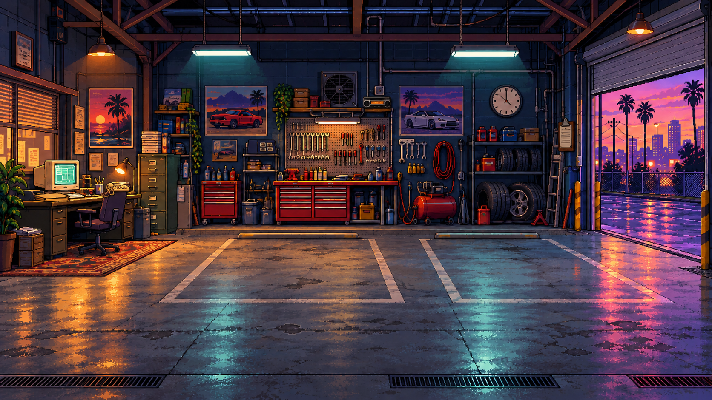

# Neon Garage '93

Pixel art autókereskedős tycoon, angol játékfelülettel. Jelenlegi verzió: v0.11.0 / Business Empire. Dokumentáció frissítve: 2026. október 10.

A játék fájljai a [`neon-garage-93`](neon-garage-93/) mappában vannak. Indításhoz töltsd le a projektet, majd nyisd meg a mappában található `index.html` fájlt böngészőben. Nincs szükség telepítésre vagy szerverre.

- [Indítás, játékmenet és tesztelés](neon-garage-93/README.md)
- [60 modelles katalógus](neon-garage-93/MODEL-CATALOG.md)
- [Aktuális fejlesztési roadmap](neon-garage-93/ROADMAP.md)
- [Verzióelőzmények és eredeti tervek](neon-garage-93/DEVELOPMENT-HISTORY.md)
- [Grafikai fájlok és generáló promptok](neon-garage-93/assets/ART-DIRECTION.md)

